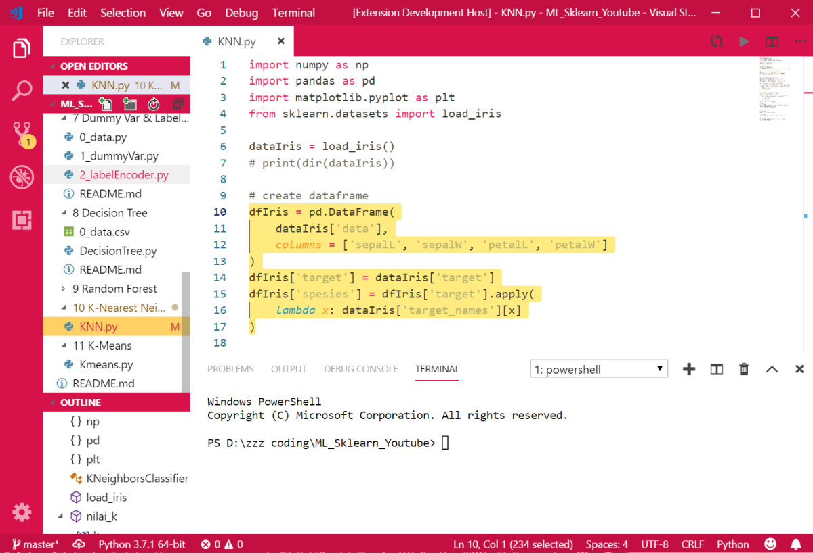

# Hello Pelapak!

[Bukalapak](https://www.bukalapak.com/) is a privately held technology company in Indonesia and one of the largest e-commerce companies in Southeast Asia with a valuation of more than US$1 billion, making it a unicorn company. Bukalapak was founded by Achmad Zaky in 2010 and started as an online marketplace, but has since expanded to providing other services both for consumers and businesses, with a particular focus on small and medium-sized enterprises. As of 2018, Bukalapak has more than 50 million users and process half a million transactions per day.
- Download theme: [VScode Bukalapak Theme](https://marketplace.visualstudio.com/items?itemName=lintangwisesa.bukalapak).
- Source code: [VScode Bukalapak Theme Source Code](https://github.com/LintangWisesa/VScode-Bukalapak-Theme).

## Preview 🔍

#

#### Lintang Wisesa 💌 _lintangwisesa@ymail.com_

[Facebook](https://www.facebook.com/lintangbagus) | 
[Twitter](https://twitter.com/Lintang_Wisesa) |
[Google+](https://plus.google.com/u/0/+LintangWisesa1) |
[Youtube](https://www.youtube.com/user/lintangbagus) | [GitHub](https://github.com/LintangWisesa) |
[Hackster](https://www.hackster.io/lintangwisesa)